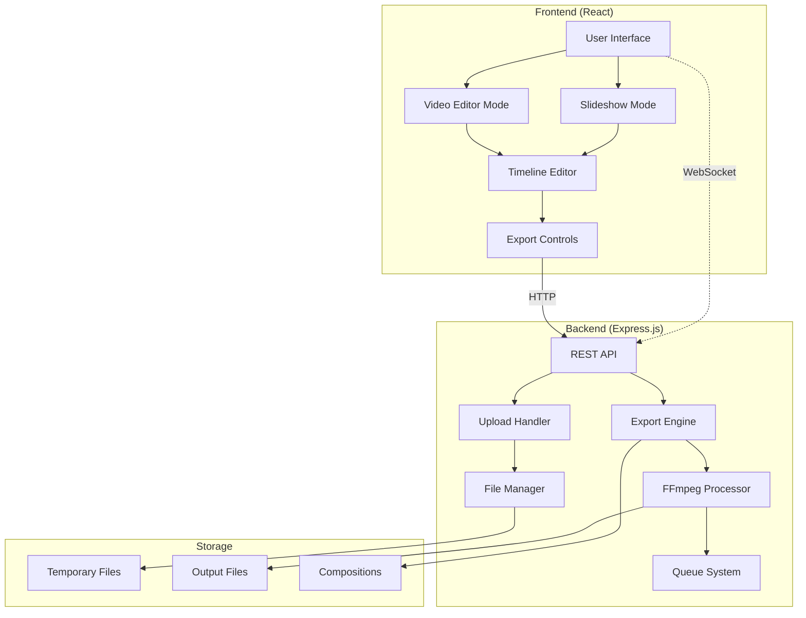
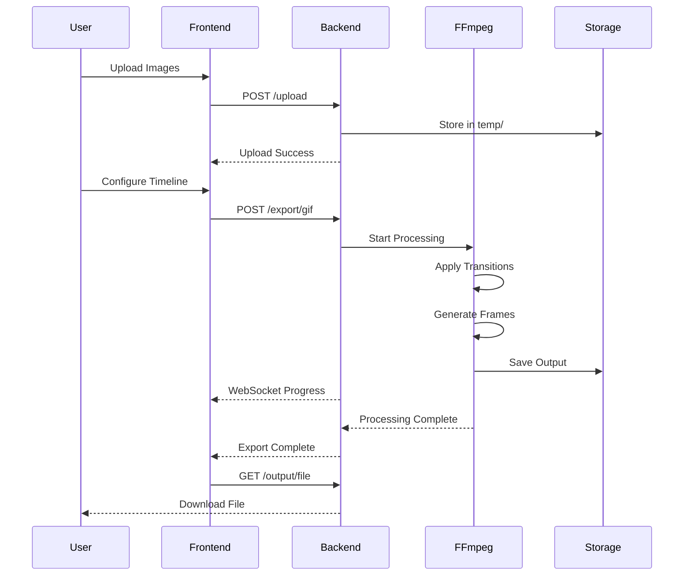
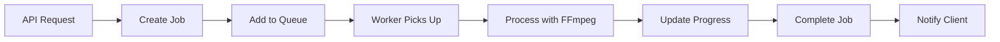

# AnimaGen Architecture

> Comprehensive guide to AnimaGen's system architecture, design patterns, and technical decisions.

## 🏗️ System Overview

AnimaGen is a full-stack web application designed for creating professional animations from images and videos. The architecture follows a clean separation between frontend and backend with real-time communication.



## 🎯 Design Principles

### 1. **Separation of Concerns**
- **Frontend**: User interface and interaction logic
- **Backend**: File processing and business logic
- **Storage**: Temporary and permanent file management

### 2. **Real-time Communication**
- WebSocket for progress updates
- REST API for data operations
- Event-driven architecture

### 3. **Scalability**
- Queue-based processing (Redis + BullMQ)
- Stateless server design
- Horizontal scaling capability

### 4. **Performance**
- Lazy loading of components
- Optimized FFmpeg pipelines
- Smart caching strategies

## 🏛️ Frontend Architecture

### Component Hierarchy

```
App.tsx
├── Router
│   ├── ModeSelector
│   ├── SlideshowApp
│   │   ├── ImageUpload
│   │   ├── Timeline
│   │   │   ├── TimelineItem
│   │   │   └── TransitionElement
│   │   ├── Preview
│   │   └── ExportControls
│   └── VideoEditorApp
│       ├── VideoUploader
│       ├── VideoTimeline
│       ├── VideoPreview
│       └── VideoExport
```

### State Management

**Context Providers:**
- `MediaProvider` - Global media state
- `SlideshowContext` - Slideshow-specific state
- `VideoEditorContext` - Video editor state

**State Structure:**
```typescript
interface AppState {
  media: {
    images: ImageItem[];
    videos: VideoItem[];
    currentSession: string;
  };
  timeline: {
    items: TimelineItem[];
    transitions: Transition[];
    duration: number;
  };
  export: {
    progress: number;
    status: ExportStatus;
    settings: ExportSettings;
  };
}
```

### Data Flow

1. **Upload Flow**
   ```
   User Upload → ImageUpload → MediaProvider → Backend API
   ```

2. **Timeline Flow**
   ```
   Drag & Drop → Timeline → SlideshowContext → Preview Update
   ```

3. **Export Flow**
   ```
   Export Button → ExportControls → API Call → WebSocket Progress → UI Update
   ```

## 🔧 Backend Architecture

### Server Structure

```
index.js (Main Server)
├── Express App Setup
├── Middleware Configuration
├── Route Registration
├── WebSocket Setup
└── Error Handling
```

### Route Organization

```
routes/
├── upload.js          # File upload endpoints
├── export.js          # Export processing endpoints
├── unified-export.js  # Unified export system
└── api.js             # General API endpoints
```

### Service Layer

```
services/
├── queue.js           # Job queue management
├── ffmpeg.js          # FFmpeg processing
├── fileManager.js     # File operations
└── composition.js     # Composition handling
```

### Worker System

```
workers/
├── exportWorker.js    # Main export processor
├── workerManager.js   # Worker lifecycle
└── jobTypes.js        # Job type definitions
```

## 🎬 Processing Pipeline

### Image to Animation Pipeline



### FFmpeg Command Generation

**GIF Export:**
```bash
ffmpeg -i input_%d.jpg \
  -filter_complex "[0:v]scale=1920:1080[v0];[v0]fps=30[out]" \
  -map "[out]" \
  -y output.gif
```

**MP4 Export:**
```bash
ffmpeg -i input_%d.jpg \
  -filter_complex "[0:v]scale=1920:1080[v0];[v0]fps=30[out]" \
  -map "[out]" \
  -c:v libx264 \
  -preset medium \
  -crf 23 \
  -y output.mp4
```

## 📁 File Management

### Directory Structure

```
backend/
├── uploads/           # Temporary uploaded files
│   └── session_*/     # Per-session directories
├── output/            # Generated exports
├── compositions/      # Saved compositions
├── logs/             # Application logs
└── temp/             # Processing temporary files
```

### File Lifecycle

1. **Upload Phase**
   - Files stored in `uploads/session_id/`
   - Metadata extracted and cached
   - Thumbnails generated

2. **Processing Phase**
   - Files copied to `temp/` for processing
   - FFmpeg operations performed
   - Progress tracked via WebSocket

3. **Output Phase**
   - Final files saved to `output/`
   - Temporary files cleaned up
   - Download URLs generated

4. **Cleanup Phase**
   - Session files removed after timeout
   - Automatic garbage collection

## 🔄 Queue System (Optional)

### Redis + BullMQ Integration

```typescript
interface JobData {
  sessionId: string;
  type: 'gif' | 'mp4' | 'webm' | 'mov';
  images: ImageItem[];
  settings: ExportSettings;
}

interface JobProgress {
  percentage: number;
  stage: string;
  message: string;
}
```

### Job Processing Flow



## 🔌 Real-time Communication

### WebSocket Events

**Client → Server:**
- `join-session` - Join session room
- `leave-session` - Leave session room

**Server → Client:**
- `export-progress` - Processing progress
- `export-complete` - Export finished
- `export-error` - Export failed

### Event Data Structure

```typescript
interface ProgressEvent {
  sessionId: string;
  progress: number;      // 0-100
  stage: string;         // 'uploading', 'processing', 'finalizing'
  message: string;       // Human-readable status
  eta?: number;          // Estimated time remaining (seconds)
}
```

## 🛡️ Security Considerations

### File Upload Security
- File type validation
- Size limits enforcement
- Malicious file detection
- Temporary file isolation

### API Security
- CORS configuration
- Rate limiting
- Input validation
- Error message sanitization

### File System Security
- Sandboxed processing
- Path traversal prevention
- Automatic cleanup
- Permission restrictions

## 📊 Performance Optimizations

### Frontend Optimizations
- **Code Splitting**: Route-based chunks
- **Lazy Loading**: Component-level loading
- **Memoization**: React.memo for expensive components
- **Virtual Scrolling**: Large timeline handling

### Backend Optimizations
- **Streaming**: Large file uploads
- **Caching**: Metadata and thumbnails
- **Compression**: Response compression
- **Connection Pooling**: Database connections

### FFmpeg Optimizations
- **Hardware Acceleration**: GPU encoding when available
- **Multi-threading**: Parallel processing
- **Preset Optimization**: Quality vs speed balance
- **Memory Management**: Efficient buffer handling

## 🔧 Configuration Management

### Environment-based Configuration

```typescript
interface Config {
  server: {
    port: number;
    cors: string[];
  };
  processing: {
    maxFileSize: number;
    maxFiles: number;
    outputDir: string;
    tempDir: string;
  };
  ffmpeg: {
    threads: number;
    preset: string;
    quality: string;
  };
  queue: {
    enabled: boolean;
    redisUrl?: string;
    concurrency: number;
  };
}
```

## 🚀 Deployment Architecture

### Development Environment
```
Frontend (Vite Dev Server) :5173
Backend (Node.js) :3001
Redis (Optional) :6379
```

### Production Environment
```
Frontend (Static Files) → CDN
Backend (PM2 Cluster) → Load Balancer
Redis Cluster → Queue Processing
File Storage → S3/Local Storage
```

## 🔄 Future Enhancements

### Planned Improvements
1. **Microservices**: Split processing into separate services
2. **Cloud Storage**: S3/GCS integration
3. **User Authentication**: Multi-user support
4. **Real-time Collaboration**: Shared editing sessions
5. **Advanced Effects**: More transition types and filters
6. **Mobile Support**: Responsive design improvements

### Scalability Roadmap
1. **Horizontal Scaling**: Multiple backend instances
2. **Database Integration**: Persistent user data
3. **CDN Integration**: Global file distribution
4. **Monitoring**: Application performance monitoring
5. **Auto-scaling**: Dynamic resource allocation
